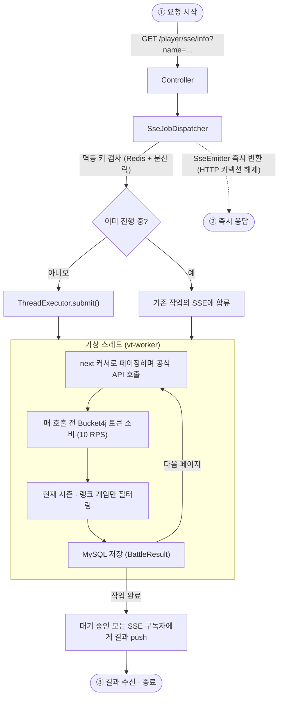

# DAYO.GG

> 이터널리턴(Eternal Return) 전적검색 서비스의 백엔드. 공식 API에서 플레이어 전투 데이터를 수집·저장하고, 티어·실험체(캐릭터)별 통계로 집계해 조회 API로 제공합니다.


**🔗 서비스: [dayogg.vercel.app](https://dayogg.vercel.app/)** (프론트엔드)

---

## 프로젝트 개요

이터널리턴 유저의 전적을 수집·집계해 조회 API로 제공하는 백엔드입니다. 공식 API에서 플레이어의 시즌 랭크 게임 전투 결과를 가져와 MySQL에 저장하고, 기간·티어·MMR 조합 조건으로 실험체·티어별 통계를 산출합니다. 전적 수집은 수십 초가 걸리는 작업이라 SSE로 진행 상황을 전달합니다.

| | |
|---|---|
| **개발 형태** | 1인 개발 (백엔드 전담) |
| **개발 기간** | 2026.04.15 ~ 2026.08.20 |
| **백엔드** | 이 저장소 |
| **프론트엔드** | [ghlee0303/dayogg_front](https://github.com/ghlee0303/dayogg_front) (별도 저장소, 동일 개발자) |
| **배포** | AWS EC2 (`production` 브랜치 자동 배포) |

> 이 서비스는 이터널리턴의 공식 서비스가 아니며, 이터널리턴 공식 API를 활용해 제작되었습니다.

---

## 주요 기능

| 기능 | 설명 |
|------|------|
| **전적 수집** | `GET /player/sse/info` — 공식 API를 커서 페이징하며 현재 시즌 랭크 게임을 수집·저장, SSE로 진행 상황 전달 |
| **전적 갱신** | `GET /player/sse/refresh` — 마지막 수집 이후의 신규 게임만 증분 수집, 멱등 처리로 중복 요청은 기존 작업에 합류 |
| **시즌 통계** | `GET /statistics/season` — 시즌 전체를 티어별로 집계 후 랭크 티어 합산 |
| **기간 통계** | `POST /statistics/range` — 기간 × 티어 구간 × MMR 구간 조합 조건으로 실험체·티어별 통계 산출 |
| **전투 결과 조회** | `POST /battle/range`, `POST /battle/range/page` — 기간별 전투 결과 (페이징) |
| **티어 구간** | `GET /tier/range` — MMR + 게임 플레이 시각 기준 커트라인으로 티어 판정, 커트라인은 스케줄러가 주기 수집 |
| **게임 메타** | `GET /meta/equip · /meta/locale · /meta/season · /meta/trait · /meta/tier_range` — 실험체·스킨·무기 명칭 현지화(KO/EN) 포함 |

> 사용자 인증 레이어는 두지 않았습니다. 공개 전적 조회 서비스로 설계했고, 트래픽 남용은 API 레이트 리밋(10 RPS)과 CORS 허용 출처 제한으로 관리합니다.

---

## 기술 스택

| 분류 | 사용 기술 |
|------|-----------|
| 언어 | Java 21 (Virtual Threads) |
| 프레임워크 | Spring Boot 4.0.0 |
| 데이터베이스 | MySQL 8.0+ (운영: AWS RDS) |
| 캐시 / 분산 락 | Redis, Redisson |
| ORM / 쿼리 | Spring Data JPA, QueryDSL 7.0 |
| 레이트 리밋 | Bucket4j 8.8 (API / 크롤링 버킷 분리) |
| 빌드 | Gradle |
| 배포 | Docker Compose · GitHub Actions · ghcr.io · AWS EC2 |
| 관측성 | 구조화 로깅(ECS JSON) → AWS CloudWatch Logs |

---

## 아키텍처

### 설계 원칙

- **계층 구조** — Controller → Service → Repository 단방향 의존, 계층 건너뛰기 없음
- **횡단 관심사 분리** — 로깅·분산 락·레이트 리밋·예외를 AOP와 `core` 패키지로 도메인 코드에서 걷어냄
- **조회 쿼리는 전부 QueryDSL** — 동적 조건은 조건 객체(`*Condition` / `*Predicate`)로 캡슐화, JPQL·네이티브 쿼리 미사용
- **DTO 변환은 MapStruct** — 수동 매핑 코드 없음
- **예외 일원화** — `BusinessException` + `@RestControllerAdvice`, 응답용(`ExceptionResponseEnum`)과 로그용(`LogMessageEnum`)을 분리

### 요청 처리 흐름

전적 수집 요청이 들어오면 컨트롤러는 `SseEmitter`만 즉시 반환하고, 실제 수집은 가상 스레드에서 비동기로 진행됩니다. 결과는 작업이 끝난 뒤 SSE로 push됩니다.



### 공통 모듈 (`core`)

도메인 코드가 로깅·락·예외 처리로 오염되지 않도록 `core` 패키지에 모았습니다.

| 모듈 | 역할 |
|------|------|
| `annotation/*_logging` | 계층별 로깅 AOP — `@ControllerLogging` / `@ServiceLogging` |
| `annotation/distributed_lock` | Redisson `RLock` + SpEL 키 추출 — `@DistributedLock("#key")` |
| `bucket` | Bucket4j 레이트 리밋 — 공식 API용(10 RPS)과 크롤링용 버킷 분리 |
| `idempotent` | Redis 저장 + 분산 락으로 원자적 합류/생성 |
| `sse` | emitter 등록·브로드캐스트·정리, 멱등 키 단위 다중 구독자 전송 |
| `thread` | 가상 스레드 executor + 세마포어 기반 동시 실행 상한 |

### 외부 통신

- 공식 API 호출 직전마다 `BucketService.apiBucketBlocking()`, dak.gg 크롤링 직전마다 `crawlingBucketBlocking()`으로 토큰을 소비 — 버킷을 거치지 않는 외부 호출은 10 RPS 상한을 깨뜨림
- API 서버 주소·키는 `GAME_API_URL` / `GAME_API_KEY` 환경변수로 주입

---

## 기술적 도전

### 1. 10 RPS 제약 아래에서 응답성 확보

이터널리턴 공식 API는 초당 10회 상한을 가지는데, 플레이어 한 명의 전적을 수집하려면 페이징을 돌며 API를 수십 번 호출해야 해서 요청 하나에 수 초~수십 초가 걸립니다. 이 시간의 대부분은 연산이 아니라 **토큰을 기다리는 블로킹**입니다.

가상 스레드(블로킹 시 캐리어 스레드 반납) + SSE(컨트롤러는 `SseEmitter`만 즉시 반환하고 완료 후 push) + 세마포어(동시 실행 상한, 초과 시 `429`) + 멱등 처리(진행 중인 동일 요청은 기존 작업의 SSE에 합류)를 조합했습니다. 멱등 처리에서 조회와 생성은 반드시 하나의 락 구간 안에 있어야 하므로 `joinOrCreate` 단일 메서드로 묶고 `@DistributedLock`을 적용했습니다.

→ 상세: [동시성 설계](docs/concurrency.md)

### 2. 통계 집계 — 조건 조합과 병합 책임 분리

통계 조회 조건은 **기간 × 티어 구간 × MMR 구간**의 조합으로 들어옵니다. 서비스 코드에 쿼리 조건이 흩어지지 않도록 `BattleResultRangeCondition`·`StatisticsPredicate` 조건 객체로 분리했고, 병합 로직은 응답 타입(`StatisticsResponse.Tier` / `.Range`)이 `merge()`로 직접 소유하게 해서 집계 서비스는 조회와 분기만 담당합니다.

티어 커트라인은 성격이 달라 `TopTierCutScheduler`가 주기적으로 수집·저장하고, 티어 계산 시 **게임 플레이 시각 기준**으로 가장 가까운 커트라인을 찾습니다 — 같은 MMR이라도 시점에 따라 티어가 달라지기 때문입니다.

→ 상세: [통계 집계 설계](docs/statistics.md)

### 3. 운영 로그를 CloudWatch로 — 수집량이 곧 비용

CloudWatch Logs는 수집량이 그대로 과금으로 이어지고, Spring 기본 평문 로그는 필드 단위 질의도 되지 않습니다. 로그 1줄 = ECS JSON 이벤트 1개로 통일하고, AOP(`@ControllerLogging` / `@ServiceLogging`)로 도메인 코드 밖에서 로그를 생성하도록 했습니다.

값이 사실상 상수인 필드(`service.name`, `process.pid`, `thread.name`)는 인코더 단계에서 제외하고, 프레임워크 로그는 `warn` 이상만 내보냅니다. `code`·`jobId`·`idempotentKey`를 추적 축으로 삼아 한 요청의 컨트롤러→서비스→SSE 전 구간을 이어 볼 수 있습니다.

→ 상세: [구조화 로깅](docs/logging.md)

---

## 배포

`production` 브랜치에 push하면 GitHub Actions가 이미지를 빌드해 ghcr.io에 올리고, 서버에 SSH로 접속해 새 이미지로 교체합니다.


- **DB 분리** — 운영 MySQL은 EC2 메모리 절약을 위해 RDS로 분리, Redis는 캐시·분산 락 용도라 EC2 컨테이너로 유지
- **스키마 안전장치** — 운영은 `JPA_DDL_AUTO=validate`로 기동해 엔티티·스키마 불일치 시 조용한 손상 대신 기동을 실패시킴
- **디스크 관리** — EC2 디스크가 빠듯해 배포 스크립트(`scripts/dayogg_script`)가 이미지 pull 전에 미참조 이미지·빌드 캐시를 자동 정리

→ 상세: [배포 가이드](docs/deployment.md)

---

## 로컬 실행

```bash
# 빌드
./gradlew build

# 실행 (http://localhost:8080)
./gradlew bootRun

# 테스트
./gradlew test

# Docker로 MySQL·Redis까지 통째로
docker compose up -d --build
```

### 환경변수

`DB_PASSWORD`와 `GAME_API_KEY`는 기본값이 없으며 설정하지 않으면 기동되지 않습니다. 로컬은 프로젝트 루트에 `.env`를 두고 사용하며, 필요한 변수는 [`.env.example`](.env.example)에 문서화되어 있습니다.

```
DB_PASSWORD=your_password
GAME_API_KEY=your_api_key   # https://developer.bser.io 에서 발급
```

전체 설정값은 [시작하기](docs/getting-started.md) 참고.

---

## 프로젝트 구조

<details>
<summary>디렉토리 트리</summary>

```
src/main/java/eternal_return/dayogg/
├─ DayoGGBackApplication.java   # 앱 진입점 (@EnableScheduling)
│
├─ battle_result/               # 외부 API 호출 → 전투 결과 저장
├─ statistics/                  # 전투 결과 집계 → 통계 산출
│  ├─ condition/ predicate/     # QueryDSL 조건 객체
│  ├─ range/ map_key/ extend/
│  └─ dto/ repository/ service/
├─ player/                      # 플레이어 프로필
│  ├─ client/                   # 외부 사용자 API 클라이언트
│  ├─ player_season/            # 시즌별 플레이어 스냅샷
│  └─ service/facade/
├─ tier/                        # MMR 기반 티어 계산
│  └─ top_tier_cut/             # 최상위 티어 커트라인 수집 스케줄러
├─ meta/                        # 게임 메타데이터 (시즌·로케일 등)
│  └─ config/                   # 메타 JSON → 빈 로딩
├─ route_auth/                  # dak.gg 루트 크롤링 기반 본인 확인
├─ health/                      # 헬스 체크
│
├─ common/                      # 공용 Enum, 로깅 컨텍스트, 유틸
└─ core/                        # 인프라 컴포넌트
   ├─ annotation/               # AOP 어노테이션 및 Aspect
   │  ├─ controller_logging/ service_logging/
   │  └─ distributed_lock/      # @DistributedLock (Redisson)
   ├─ api/                      # 외부 API/크롤링 클라이언트
   ├─ bucket/                   # Bucket4j Rate Limiter
   ├─ idempotent/               # Redis 기반 멱등성 처리
   ├─ sse/                      # SSE 비동기 잡 실행기
   ├─ thread/                   # 가상 스레드 executor + 세마포어
   ├─ redis/ config/ exception/ file/

src/main/resources/
├─ application.yml
└─ meta/                        # 게임 메타데이터 JSON (item·trait·phase·tier ...)
```

</details>

### 문서

- [엔지니어링 의사결정 기록](docs/engineering-decisions.md) — 10 RPS 제약 아래에서 가상 스레드·SSE·멱등·Redis·구조화 로깅을 고른 근거와 대안 비교
- [동시성 설계](docs/concurrency.md) — 10 RPS 제약, 가상 스레드·SSE·세마포어·멱등 처리
- [통계 집계 설계](docs/statistics.md) — QueryDSL 조건 객체, 응답 타입 병합, 티어 커트라인
- [인프라 · 공통 모듈 설계](docs/infrastructure.md) — `core` 패키지, AOP, 예외 일원화
- [구조화 로깅](docs/logging.md) — ECS JSON 구조, `LogContext`·MDC, `code`·`idempotentKey` 추적 축
- [시작하기](docs/getting-started.md) · [배포 가이드](docs/deployment.md) · [코드 컨벤션](docs/conventions.md)

---

## 라이선스 / 저작권

- 소스 코드는 개인 포트폴리오 용도로 [MIT 라이선스](LICENSE)로 공개됩니다.
- 이터널리턴 [API 이용약관](https://support.playeternalreturn.com/hc/ko/articles/49090866623257-API-%EC%9D%B4%EC%9A%A9-%EC%95%BD%EA%B4%80-2025-07-22)을 준수합니다.
- 이터널리턴 게임 콘텐츠(실험체·스킨·아이템 등)의 저작권은 **Nimble Neuron**에 있습니다.
