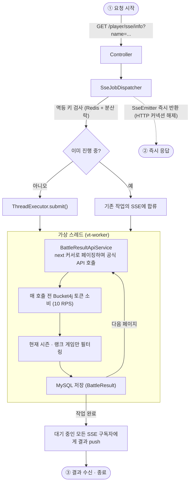
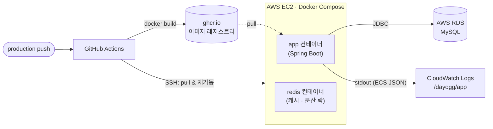

# DAYO.GG

배틀로얄 게임 **Eternal Return**의 전적을 수집하고 통계로 가공해 제공하는 백엔드 서비스입니다.

- **개인 프로젝트** — 백엔드 설계·구현 단독 담당 (프론트엔드는 별도 저장소)
- **데모** — https://dayogg.vercel.app/
- **배포** — AWS EC2에서 운영 중 · `production` 브랜치 push 시 GitHub Actions로 자동 배포 ([상세](docs/deployment.md))
- Java 21 · Spring Boot 4.0.0 · MySQL · Redis / 자바 파일 약 190개, 8개 도메인 패키지

공식 API에서 플레이어 전적을 수집해 저장하고, 이를 티어·캐릭터별 통계로 집계해 조회 API로 제공합니다. 수집은 수십 초가 걸리는 작업이라 SSE로 결과를 전달합니다.

## 핵심 설계

| | 주제 | 핵심 판단 |
|---|------|-----------|
| 1 | [동시성 설계](docs/concurrency.md) | 외부 API 10 RPS 제약 아래에서 응답성을 확보하기 위해 가상 스레드 + SSE + 세마포어 + 멱등 처리를 조합 |
| 2 | [통계 집계 설계](docs/statistics.md) | 기간·티어·MMR 조합 조건을 QueryDSL 조건 객체로 분리하고, 병합 로직은 응답 타입이 직접 소유하게 설계 |
| 3 | [인프라 · 공통 모듈 설계](docs/infrastructure.md) | 로깅·분산 락·예외·레이트 리밋을 AOP와 `core` 패키지로 분리해 도메인 코드에서 걷어냄 |

## 기술 스택

| 항목 | 내용 |
|------|------|
| Language | Java 21 (Virtual Threads) |
| Framework | Spring Boot 4.0.0 |
| DB | MySQL 8.0+ (`eternal_return` 스키마 · 운영은 AWS RDS) |
| Cache / Lock | Redis, Redisson (분산 락) |
| ORM | Spring Data JPA + QueryDSL 7.0 |
| Rate Limit | Bucket4j (API / 크롤링 버킷 분리) |
| 배포 | Docker Compose · GitHub Actions · ghcr.io · AWS EC2 |
| 관측성 | 구조화 로깅(ECS JSON) → AWS CloudWatch Logs |

## 시스템 개요

플레이어 전적 수집 요청이 들어왔을 때의 흐름입니다.



## API

| Method | Path | 설명 |
|--------|------|------|
| `GET` | `/player/sse/info` | 플레이어 정보 수집 (SSE) |
| `GET` | `/player/sse/refresh` | 플레이어 정보 갱신 (SSE) |
| `GET` | `/player/season` | 플레이어 시즌 상세 조회 |
| `POST` | `/battle/range` | 기간별 전투 결과 조회 |
| `POST` | `/battle/range/page` | 기간별 전투 결과 페이징 조회 |
| `GET` | `/statistics/season` | 시즌 전체 통계 조회 |
| `POST` | `/statistics/range` | 기간별 통계 조회 |
| `GET` | `/tier/range` | 티어 구간 조회 |
| `GET` | `/meta/equip` `/meta/locale` `/meta/season` `/meta/trait` `/meta/tier_range` | 게임 메타데이터 조회 |

> 사용자 인증 레이어는 두지 않았습니다. 공개 전적 조회 서비스로 설계했고, 트래픽 남용은 API 레이트 리밋(10 RPS)과 CORS 허용 출처 제한으로 관리합니다.

## 프로젝트 구조

```
src/main/java/eternal_return/dayogg/
├── DayoGGBackApplication.java   # 앱 진입점
├── battle_result/               # 외부 API 호출 → 전투 결과 저장
├── statistics/                  # 전투 결과 집계 → 통계 산출
├── player/                      # 플레이어 프로필 및 시즌 스냅샷
├── tier/                        # MMR 기반 티어 계산, 커트라인 수집 스케줄러
├── route_auth/                  # 루트 인증 기반 본인 확인 → 데이터 삭제
├── meta/                        # 게임 메타데이터 (시즌·로케일 등)
├── common/                      # 공용 Enum, 로깅 컨텍스트, 유틸
└── core/                        # 인프라 (AOP, SSE, Redis, 스레드, 예외 처리 등)
```

## 배포 · 운영

`production` 브랜치에 push하면 GitHub Actions가 이미지를 빌드해 ghcr.io에 올리고, 서버에 SSH로 접속해 새 이미지로 교체합니다.



- **DB 분리** — 운영 MySQL은 EC2 메모리 절약을 위해 RDS로 분리, Redis는 캐시·분산 락 용도라 EC2 컨테이너로 유지
- **로그 조회** — 앱 로그는 `awslogs` 드라이버로 CloudWatch에 적재, Logs Insights에서 `elapsedMs`·`code`·`jobId` 필드 단위로 질의
- **스키마 안전장치** — 운영은 `JPA_DDL_AUTO=validate`로 기동해 엔티티·스키마 불일치 시 조용한 손상 대신 기동을 실패시킴
- **디스크 관리** — EC2 디스크가 빠듯해 배포 스크립트(`scripts/dayogg_script`)가 이미지 pull 전에 미참조 이미지·빌드 캐시를 자동 정리

절차와 트러블슈팅은 [배포 문서](docs/deployment.md)에 정리했습니다.

## 문서

### 프로젝트 주제 (상세)

- [1. 동시성 설계](docs/concurrency.md) — 10 RPS 제약, 가상 스레드·SSE·세마포어·멱등 처리
- [2. 통계 집계 설계](docs/statistics.md) — QueryDSL 조건 객체, 응답 타입 병합, 티어 커트라인
- [3. 인프라 · 공통 모듈 설계](docs/infrastructure.md) — `core` 패키지, AOP, 예외 일원화

### 그 외

- [시작하기](docs/getting-started.md) — 요구 사항, 환경 변수, 실행·빌드, `application.yml` 설정값
- [배포](docs/deployment.md) — CI/CD 파이프라인, 서버 최초 세팅, RDS 이관, 트러블슈팅
- [코드 컨벤션](docs/conventions.md) — 계층 구조, QueryDSL·MapStruct·AOP 로깅, 예외 처리, 버킷 사용 규칙
- [구조화 로깅](docs/logging.md) — JSON 로그 구조, `LogContext`·MDC·`StructuredLog` 사용법, `code`·`idempotentKey` 추적 축
