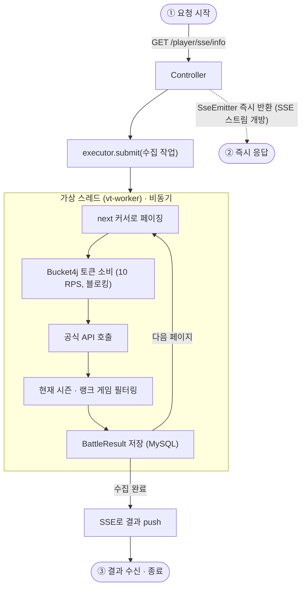

# 1. 동시성 설계

[← README로 돌아가기](../README.md)

외부 API의 **10 RPS** 제약 아래에서 응답성을 확보하기 위해 가상 스레드 + SSE + 세마포어 + 멱등 처리를 조합했습니다.

## 전체 흐름 — 요청부터 응답까지

요청이 들어오면 컨트롤러는 `SseEmitter`만 즉시 돌려주고, 실제 수집은 가상 스레드에서 비동기로 진행됩니다. 결과는 작업이 끝난 뒤 SSE 이벤트로 push됩니다.



## 배경 — 10 RPS라는 낮은 호출 상한

이터널리턴 공식 API는 **초당 10회(10 RPS)** 라는 낮은 호출 상한을 가집니다. 반면 플레이어 한 명의 전적을 수집하려면 페이징을 돌며 API를 수십 번 호출해야 하므로, 요청 하나가 완료되기까지 수 초에서 수십 초가 걸립니다.

이때 소요 시간의 대부분은 연산이 아니라 **토큰을 기다리는 블로킹**입니다. `ApiService`는 호출 직전마다 Bucket4j 토큰을 소비하고, 토큰이 없으면 다음 리필까지 대기합니다.

```java
// BucketService — 유일한 토큰 소비 지점
bucket.asBlocking().consume(1);   // 토큰이 없으면 다음 리필까지 블로킹
```

즉 이 서비스의 처리량은 CPU나 DB가 아니라 **외부 API의 10 RPS에 고정**됩니다. 스레드는 일하는 대신 대부분 멈춰서 기다립니다. 아래 세 가지는 이 제약을 전제로 한 선택입니다.

## 해결 1 — 가상 스레드로 대기 비용 제거

플랫폼 스레드로 이 구조를 만들면, 대기하는 동안 OS 스레드가 그대로 묶여 낭비됩니다. 가상 스레드는 블로킹 시 캐리어 스레드를 반납하므로, 적은 수의 OS 스레드로 다수의 대기를 감당할 수 있습니다. **대기가 길다는 제약이 오히려 가상 스레드에 유리하게 작용하는 지점**입니다.

```java
// ThreadConfig — 태스크마다 새 가상 스레드 생성
ThreadFactory factory = Thread.ofVirtual().name("vt-worker-", 0).factory();
return Executors.newThreadPerTaskExecutor(factory);
```

## 해결 2 — SSE로 HTTP 요청과 작업을 분리

수십 초짜리 작업을 HTTP 요청에 그대로 물려두면 커넥션이 장시간 점유됩니다. 컨트롤러는 작업을 가상 스레드에 제출한 뒤 **`SseEmitter`를 즉시 반환**하고, 작업이 끝나면 SSE로 결과를 push합니다.

`SseJobDispatcher`는 제출 실패 시 emitter와 멱등 키를 되돌리는 정리 경로까지 포함합니다. emitter가 컨트롤러로 반환되기 전에는 async가 시작되지 않아 타임아웃 콜백이 돌지 않고, 이때 정리하지 않으면 emitter 맵에 영구히 남기 때문입니다.

## 해결 3 — 동시 실행 상한과 중복 제거

가상 스레드는 수십만 개까지 만들 수 있지만, 외부 API와 DB 부하를 고려해 상한을 둡니다.

- **`ThreadLimiter`** — `Semaphore(max-permits)`로 동시 실행 수를 제한합니다. 제한 시간 내에 퍼밋을 얻지 못하면 `ThreadTimeoutException` → `429 Too Many Requests`로 응답합니다.
- **`IdempotentService`** — Redis 기반 멱등 키로, 동일 요청이 이미 진행 중이면 새로 실행하지 않고 해당 작업의 SSE 결과에 합류시킵니다. 중복 호출 자체를 없애 한정된 토큰을 아낍니다.

멱등 처리에서 **조회와 생성은 반드시 하나의 락 구간 안에 있어야 합니다.** 두 메서드로 나누면 그 사이에 락이 풀려, 동시 요청이 모두 "진행 중인 작업 없음"으로 판단하고 각자 멱등 키를 생성(= 서로 덮어쓰기)하면서 중복 실행되고 먼저 등록된 `sseKey`가 유실됩니다. 그래서 `joinOrCreate`라는 단일 메서드로 묶었습니다.

```java
@DistributedLock(value = "#key")
public boolean joinOrCreate(String key, String sseKey) { ... }  // 합류 true / 신규 생성 false
```

## 관련 설정

버킷 용량, 동시 실행 상한, 타임아웃 등의 설정값은 [시작하기 — 애플리케이션 설정](getting-started.md#애플리케이션-설정-applicationyml)에 정리했습니다.
