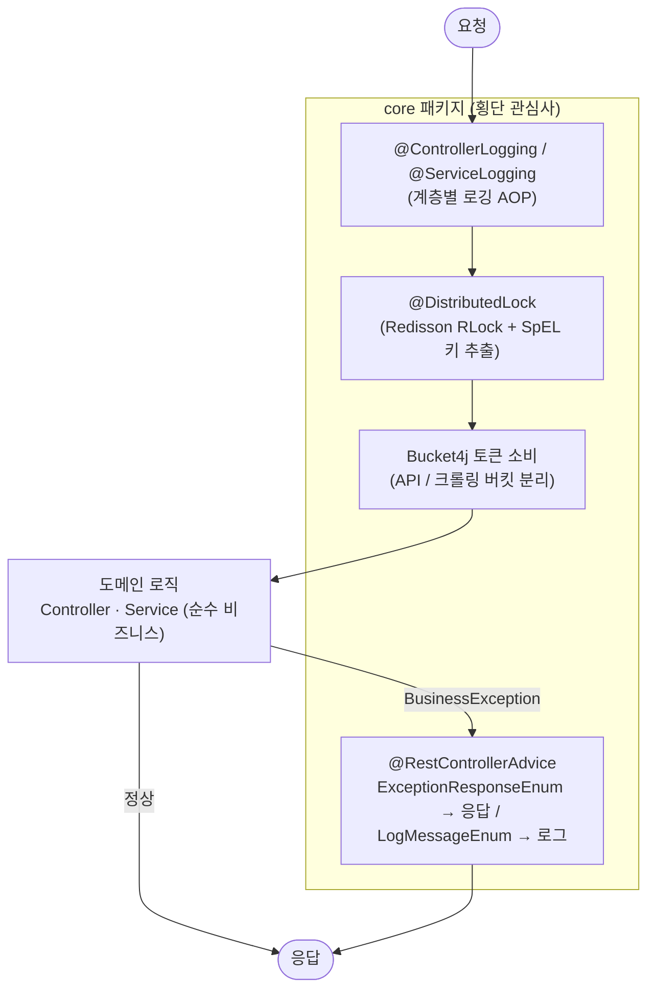

# 3. 인프라 · 공통 모듈 설계

[← README로 돌아가기](../README.md)

로깅·분산 락·예외·레이트 리밋을 AOP와 `core` 패키지로 분리해 도메인 코드에서 걷어냈습니다.

## 관심사 분리 구조

도메인 로직(Controller/Service)은 순수 비즈니스 코드만 담고, 로깅·락·레이트 리밋·예외 같은 횡단 관심사는 `core`가 AOP로 감쌉니다.



## core 패키지

도메인 코드가 로깅·락·예외 처리로 오염되지 않도록 `core` 패키지에 모았습니다.

| 모듈 | 역할 | 구현 |
|------|------|------|
| `annotation/distributed_lock` | 분산 락 | Redisson `RLock` + SpEL로 키 추출 → `@DistributedLock("#key")` |
| `annotation/*_logging` | 계층별 로깅 | `@ControllerLogging` / `@ServiceLogging` AOP — 로깅 코드가 비즈니스 로직에 섞이지 않음 |
| `bucket` | 레이트 리밋 | 공식 API용(10회/초)과 크롤링용(1회/2초) 버킷을 분리 — 성격이 다른 트래픽이 서로의 토큰을 잠식하지 않게 함 |
| `sse` | SSE 수명 관리 | emitter 등록·브로드캐스트·정리, 멱등 키 단위 다중 구독자 전송 |
| `thread` | 실행 제어 | 가상 스레드 executor + 세마포어 기반 동시 실행 상한 |
| `idempotent` | 중복 요청 처리 | Redis 저장 + 분산 락으로 원자적 합류/생성 |
| `exception` | 예외 일원화 | `BusinessException` + `@RestControllerAdvice` — 응답 코드와 로그 메시지를 Enum으로 분리 |

## 예외 처리 — 응답용과 로그용 분리

예외는 응답용(`ExceptionResponseEnum`)과 로그용(`LogMessageEnum`)을 나눴습니다. 클라이언트에 나갈 메시지와 서버에 남길 메시지의 목적이 다르고, 후자에만 식별자 같은 내부 값이 들어가기 때문입니다.

```java
throw new BusinessException(
        ExceptionResponseEnum.ROUTE_AUTH_DUPLICATE,
        LogMessageEnum.DUPLICATE_ROUTE_AUTH.format(routeId, playerId)
);
```
