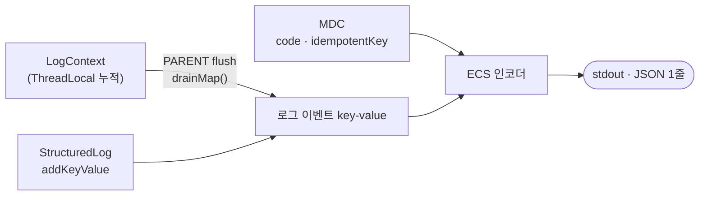

# 구조화 로깅

로그를 텍스트 한 줄이 아니라 **JSON 객체 한 줄**로 남깁니다.
`playerId`, `elapsedMs` 같은 값이 문자열 안에 박히지 않고 **독립된 필드**로 나가므로,
`elapsedMs > 1000` 같은 조건으로 질의·집계할 수 있습니다.

```
Before  [playerInfo] | 123ms | playerId: 42 |
After   {"message":"[playerInfo] done","playerId":42,"elapsedMs":123,"code":"A1B2C3"}
```

## 설정

Spring Boot 내장 구조화 로깅(3.4+)을 씁니다. 추가 의존성은 없습니다.

```yaml
# application.yml
spring:
  main:
    banner-mode: "off"        # 배너는 로깅 시스템을 안 거쳐 평문으로 나온다
logging:
  structured:
    format:
      console: ecs            # Elastic Common Schema
  level:
    root: warn                # 프레임워크 로그는 warn 이상만
    eternal_return.statistics: info
```

`root: warn` 이므로 **본인 패키지 밖 로그는 INFO 가 나오지 않습니다.** 남겼는데 안 보이면 레벨부터 확인합니다.

## 값이 필드가 되는 세 가지 통로

인코더가 값을 읽어가는 경로는 **MDC** 와 **로그 이벤트의 key-value** 둘뿐입니다.
`LogContext` 는 그 자체로는 인코더에 안 보이고, flush 시점에 key-value 로 옮겨집니다.



| | 역할 | 언제 나가나 | 값 타입 |
|---|---|---|---|
| **MDC** | 요청·잡 전체를 잇는 추적 축 | 같은 스레드의 **모든 이벤트**에 자동 부착 | String 만 |
| **LogContext** | 여러 메서드에 걸쳐 값 누적 | `@ServiceLogging(PARENT)` 종료 시 한 번에 | Object (숫자 보존) |
| **StructuredLog** | 그 자리에서 이벤트 하나 발행 | `.log()` 즉시 | Object (숫자 보존) |

## 어떻게 남기는가

### 1. 서비스 안에서 도메인 값 — `LogContext`

`@ServiceLogging` 이 붙은 메서드 안이면 값만 쌓아두면 됩니다.
PARENT 가 끝날 때 `drainMap()` 으로 꺼내져 한 이벤트의 필드가 됩니다.

```java
@ServiceLogging(loggingType = LoggingType.PARENT)
public SseJobResult refresh(Long playerId) {
    LogContext.put("playerId", playerId);   // → "playerId":123
    ...
}

// 하위 계층에서 누적도 가능 — 호출 횟수만큼 합산된다
LogContext.addLong("apiMillis", elapsed);   // → "apiMillis":1720
LogContext.addLong("apiCount", 1L);         // → "apiCount":3
```

`Long`·`Integer` 를 그대로 넣으면 JSON 숫자로 나갑니다.
flush 해줄 PARENT 가 없으면 **값은 그냥 버려집니다.**

기본값인 CHILD 는 자기 로그를 남기지 않고 **소요 시간만 컨텍스트에 넣습니다.**
바깥 PARENT 가 flush 할 때 메서드명이 곧 필드명이 됩니다.

```java
@ServiceLogging                                  // CHILD
public BattleResultApiResult fetchNewBattleResult(PlayerDto player) { ... }
// → 바깥 PARENT 로그에 "fetchNewBattleResult":1840 으로 실린다
```

### 2. AOP 밖에서 — `StructuredLog`

`SseService` · `ApiService` · `RedisJsonStore` 처럼 Aspect 가 감싸지 않는 지점에서 씁니다.
SLF4J 의 `LoggingEventBuilder` 를 그대로 돌려주므로 `addKeyValue` 를 이어 붙이고 `log(...)` 로 끝냅니다.

```java
StructuredLog.warn(log, "api")
        .addKeyValue("attempt", attempt)     // 숫자 그대로
        .addKeyValue("http.uri", uri)
        .log("[API] null response");

StructuredLog.error(log, "redis", e)         // error.type · error.message 자동
        .addKeyValue("operation", "serialize")
        .log("[REDIS] serialization failed");
```

| 메서드 | 용도 |
|---|---|
| `info(log, layer)` / `warn(log, layer)` | 값만 있는 로그 |
| `warn(log, layer, e)` / `error(log, layer, e)` | 예외 — `error.type`·`error.message` 자동 |

첫 인자로 **호출하는 클래스의 로거**를 넘겨야 이벤트의 `log.logger` 가 발생 지점으로 남습니다.

### 3. 요청 전체에 붙일 축 — MDC

여러 이벤트에 걸쳐 따라붙어야 하는 값만 넣습니다. 현재 `code` 와 `idempotentKey` 둘뿐입니다.

```java
MDC.put("code", generateCode());   // ControllerLoggingAspect
```

**정리는 직접 하지 않습니다.** `ControllerLoggingAspect` 가 진입 시점 스냅샷을 잡아
요청 종료 시 `setContextMap` 으로 일괄 복원합니다.
중간에서 `MDC.clear()` 를 부르면 상위의 `code` 까지 지워집니다.

## 추적 축 — `code` 와 `idempotentKey`

SSE 는 요청 스레드와 잡 실행 스레드가 갈리고, `joinOrCreate` 때문에 **요청 N 개가 잡 1 개를 공유**합니다.
특정 요청의 `code` 를 잡에 붙이면 오해를 부르므로 축을 둘로 나눕니다.

| 축 | 범위 | 부여 지점 |
|---|---|---|
| `code` | 요청 하나 (6자리 영숫자) | `ControllerLoggingAspect` |
| `idempotentKey` | 잡 하나 | `SseJobDispatcher` |

컨트롤러 로그에만 **둘 다** 찍히므로, 조회는 `code` → `idempotentKey` → 잡 로그 순의 2단으로 합니다.

## 이벤트 필드

| 필드 | 출처 |
|---|---|
| `@timestamp` · `log.level` · `log.logger` · `message` | 인코더 기본 |
| `service.name` · `process.*` · `ecs.version` | 인코더 기본 |
| `code` · `idempotentKey` | MDC |
| `layer` | `controller` / `service` / `sse` / `api` / `redis` / `exception` |
| `method` · `elapsedMs` | `@ServiceLogging` |
| `http.method` · `http.uri` · `client.ip` · `tag` | `@ControllerLogging` |
| `error.type` · `error.message` | 실패 경로 |
| 그 외 | `LogContext` · `addKeyValue` 로 넣은 도메인 값 |

점(`.`)이 든 필드는 JSON 에서 **중첩 객체**가 됩니다 — `http.uri` → `{"http":{"uri":...}}`.

## 실제 출력

`GET /player/sse/refresh?playerId=123` 한 번에 세 줄이 나옵니다 (가독성을 위해 기본 필드는 생략).

```json
{"message":"[GET /player/sse/refresh] done","code":"A1B2C3","idempotentKey":"player-refresh:123",
 "layer":"controller","http":{"method":"GET","uri":"/player/sse/refresh"},
 "client":{"ip":"1.2.3.4"},"tag":"player-refresh","elapsedMs":12}

{"message":"[refresh] done","idempotentKey":"player-refresh:123","layer":"service",
 "method":"refresh","elapsedMs":2015,"playerId":123,
 "apiMillis":1720,"apiCount":3,"fetchNewBattleResult":1840,"resolveTier":0}

{"message":"[SSE-SEND] sent","idempotentKey":"player-refresh:123","layer":"sse",
 "sseKey":"7f3c...","event":"message","dataType":"SseJobResult"}
```

컨트롤러는 SSE 잡을 던지고 바로 반환하므로 `elapsedMs` 가 짧습니다.
`refresh` 는 PARENT 하나뿐이라 하위 CHILD 의 소요 시간(`fetchNewBattleResult`)과
`ApiService` 가 누적한 값(`apiMillis`·`apiCount`)이 **한 줄로 합쳐집니다.**
잡 로그에 `code` 가 없는 것은 의도된 설계입니다.

> 같은 CHILD 를 여러 번 호출하면 키가 덮어써져 **마지막 값만** 남습니다
> (`resolveTier` 는 게임 수만큼 호출되지만 1회분만 찍힙니다).
> 합계가 필요하면 `apiMillis` 처럼 `addLong` 으로 누적해야 합니다.

## 하지 말 것

| | |
|---|---|
| `log.info("playerId: {}", id)` | 값이 `message` 에 박혀 질의가 안 됩니다 |
| `MDC.put("elapsedMs", String.valueOf(ms))` | MDC 는 String 만 담아 `"123"` 으로 나갑니다. 문자열 비교라 `"99" > "1000"` 이 참이 되어 지연 시간 질의가 조용히 틀립니다 |
| `addKeyValue("error.type", ...)` + `setCause(e)` | 인코더가 만드는 `error` 객체와 이름이 충돌해 **그 로그 이벤트가 통째로 버려집니다** (`IllegalStateException: The name 'error' has already been written`). 스택트레이스가 필요하면 `setCause` 만 씁니다 |
| `System.out.println` | 평문 줄이 섞여 "1줄 = 1이벤트" 전제가 깨집니다 |

## 조회

현재 로그는 stdout 까지만 나갑니다. 컨테이너 로그를 그대로 파싱하면 됩니다.

```bash
docker logs app | jq 'select(.playerId==123)'
docker logs app | jq 'select((.elapsedMs//0) > 1000) | {code, method, elapsedMs}'
```

```powershell
Get-Content log.txt -Tail 1 | ConvertFrom-Json
```

CloudWatch Logs 연동은 아직 적용 전입니다 — [CloudWatch 남은 작업](../claude/docs/cloudwatch-open-items.md) 참고.
