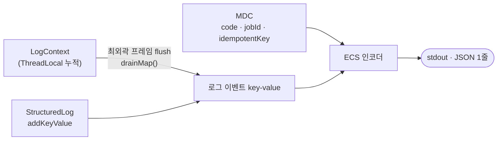

# 구조화 로깅

로그를 텍스트 한 줄이 아니라 **JSON 객체 한 줄**로 남깁니다.
`playerId`, `elapsedMs` 같은 값이 문자열 안에 박히지 않고 **독립된 필드**로 나가므로,
`elapsedMs > 1000` 같은 조건으로 질의·집계할 수 있습니다.

```
Before  [playerInfo] | 123ms | playerId: 42 |
After   {"message":"[playerInfo] done","playerId":42,"elapsedMs":123,"code":"A1B2C3"}
```

## 설정

Spring Boot 내장 구조화 로깅(3.4+)을 씁니다. 추가 의존성은 없습니다.

```yaml
# application.yml
spring:
  main:
    banner-mode: "off"        # 배너는 로깅 시스템을 안 거쳐 평문으로 나온다
    log-startup-info: false   # Spring 기동 3줄 — 아래 "기동 로그" 참고
logging:
  structured:
    format:
      console: ecs            # Elastic Common Schema
    json:
      exclude:                # 값이 상수인 블록은 인코더 단계에서 뺀다
        - service
        - process
        - ecs
  level:
    root: warn                # 프레임워크 로그는 warn 이상만
    eternal_return.dayogg: info
```

`root: warn` 이므로 **본인 패키지 밖 로그는 INFO 가 나오지 않습니다.** 남겼는데 안 보이면 레벨부터 확인합니다.

`exclude` 는 인코더가 모든 이벤트에 붙이는 `service`·`process`·`ecs` 블록을 지웁니다.
`service.name` 은 로그 그룹이 이 앱 전용이라 중복이고, `process.pid` 는 컨테이너라 항상 같은 값,
`ecs.version` 은 `"8.11"` 고정입니다. 이벤트당 약 130바이트로 **수집량이 곧 CloudWatch 비용**입니다.
스레드 추적은 `process.thread.name` 대신 [`code`·`jobId` 축](#추적-축--code-와-jobid)이 대신합니다.

## 기동 로그

Spring 기본 기동 3줄(`Starting …` · `No active profile set …` · `Started … in Xs`)은 **끕니다.**
로거 이름이 `eternal_return.dayogg.DayoGGBackApplication` 이라 `root: warn` 에 걸리지 않고,
값이 message 안에 박힌 평문이라 질의도 안 됩니다. 셋은 `logStartupInfo` 플래그 하나로 묶여 있어 개별 분리가 안 됩니다.

대신 `StartupLogger` 가 `ApplicationReadyEvent` 에서 한 줄만 남깁니다 —
**CloudWatch 에서 이 줄이 곧 배포·재기동 시점입니다.**

```json
{"message":"[STARTUP] ready","layer":"lifecycle","startupMs":5863,
 "profile":"default","version":"0.0.1-SNAPSHOT"}
```

`version` 은 매 이벤트에서 뺀 `service.version` 을 여기 한 줄에만 싣는 것입니다 — 어느 빌드가 도는지는 알아야 합니다.
jar 매니페스트에서 읽으므로 IDE 로 띄우면 `unknown` 입니다.

## 값이 필드가 되는 세 가지 통로

인코더가 값을 읽어가는 경로는 **MDC** 와 **로그 이벤트의 key-value** 둘뿐입니다.
`LogContext` 는 그 자체로는 인코더에 안 보이고, flush 시점에 key-value 로 옮겨집니다.



| | 역할 | 언제 나가나 | 값 타입 |
|---|---|---|---|
| **MDC** | 요청·잡 전체를 잇는 추적 축 | 같은 스레드의 **모든 이벤트**에 자동 부착 | String 만 |
| **LogContext** | 여러 메서드에 걸쳐 값 누적 | 최외곽 `@ServiceLogging` 종료 시 한 번에 | Object (숫자 보존) |
| **StructuredLog** | 그 자리에서 이벤트 하나 발행 | `.log()` 즉시 | Object (숫자 보존) |

## 어떻게 남기는가

### 1. 서비스 안에서 도메인 값 — `LogContext`

`@ServiceLogging` 이 붙은 메서드 안이면 값만 쌓아두면 됩니다.
사슬의 최외곽이 끝날 때 `drainMap()` 으로 꺼내져 한 이벤트의 필드가 됩니다.

```java
@ServiceLogging
public SseJobResult refresh(Long playerId) {
    LogContext.put("playerId", playerId);   // → "playerId":123
    ...
}

// 하위 계층에서 누적도 가능 — 호출 횟수만큼 합산된다
LogContext.addLong("apiMillis", elapsed);   // → "apiMillis":1720
LogContext.addLong("apiCount", 1L);         // → "apiCount":3
```

`Long`·`Integer` 를 그대로 넣으면 JSON 숫자로 나갑니다.

**한 줄을 낼 프레임은 선언하지 않습니다.** 스레드에서 `@ServiceLogging` 에 가장 먼저 진입한
프레임이 자동으로 그 역할을 맡습니다. 안쪽 프레임은 자기 로그를 남기지 않고 **소요 시간만
컨텍스트에 넣고**, 최외곽이 flush 할 때 메서드명이 곧 필드명이 됩니다.

```java
@ServiceLogging
public BattleResultApiResult fetchNewBattleResult(PlayerDto player) { ... }
// → 최외곽 로그에 "fetchNewBattleResult":1840 으로 실린다
```

|  | 성공 | 실패 |
|---|---|---|
| **최외곽** | INFO 1줄 + flush | ERROR 1줄 + flush |
| **안쪽** | 로그 없음, 소요 시간만 적립 | 발원지를 `failedAt` 에 남기고 전파 |

실패해도 flush 하므로 쌓인 값이 버려지지 않습니다. 안쪽에서 터졌다면 어느 메서드였는지가
`failedAt` 필드로 그 한 줄에 실립니다.

### 2. AOP 밖에서 — `StructuredLog`

`SseService` · `ApiService` · `RedisJsonStore` 처럼 Aspect 가 감싸지 않는 지점에서 씁니다.
SLF4J 의 `LoggingEventBuilder` 를 그대로 돌려주므로 `addKeyValue` 를 이어 붙이고 `log(...)` 로 끝냅니다.

```java
StructuredLog.warn(log, "api")
        .addKeyValue("attempt", attempt)     // 숫자 그대로
        .addKeyValue("http.uri", uri)
        .log("[API] null response");

StructuredLog.error(log, "redis", e)         // error.type · error.message 자동
        .addKeyValue("operation", "serialize")
        .log("[REDIS] serialization failed");
```

| 메서드 | 용도 |
|---|---|
| `info(log, layer)` / `warn(log, layer)` | 값만 있는 로그 |
| `warn(log, layer, e)` / `error(log, layer, e)` | 예외 — `error.type`·`error.message` 자동 |

첫 인자로 **호출하는 클래스의 로거**를 넘겨야 이벤트의 `log.logger` 가 발생 지점으로 남습니다.

### 3. 요청 전체에 붙일 축 — MDC

여러 이벤트에 걸쳐 따라붙어야 하는 값만 넣습니다. 현재 `code` · `jobId` · `idempotentKey` 셋뿐입니다.

```java
MDC.put("code", TraceCode.generate());   // ControllerLoggingAspect
```

**정리는 직접 하지 않습니다.** `ControllerLoggingAspect` 가 진입 시점 스냅샷을 잡아
요청 종료 시 `setContextMap` 으로 일괄 복원합니다.
중간에서 `MDC.clear()` 를 부르면 상위의 `code` 까지 지워집니다.

## 추적 축 — `code` 와 `jobId`

SSE 는 요청 스레드와 잡 실행 스레드가 갈리고, `joinOrCreate` 때문에 **요청 N 개가 잡 1 개를 공유**합니다.
특정 요청의 `code` 를 잡에 붙이면 합류한 나머지 요청들이 자기 `code` 로 잡 로그를 찾지 못하므로,
요청 축과 잡 축을 나눕니다.

| 축 | 범위 | 부여 지점 |
|---|---|---|
| `code` | 요청 하나 (6자리 영숫자) | `ControllerLoggingAspect` |
| `jobId` | **잡 실행 1회** (6자리 영숫자) | `SseJobDispatcher` |
| `idempotentKey` | 잡의 대상 (그룹핑용) | `SseJobDispatcher` |

컨트롤러 로그에 **셋 다** 찍히므로 조회는 `code` → `jobId` → 잡 로그의 1단입니다.
합류한 요청도 진행 중인 잡의 `jobId` 를 그대로 받으므로, 어느 요청에서 출발하든 같은 잡에 도달합니다.

> **`idempotentKey` 로 잡을 특정하면 안 됩니다.** 키는 `"player-info:" + name` 이라
> 잡이 끝나면 삭제됐다가 다음 요청 때 같은 값으로 다시 만들어집니다. 필터하면 **서로 다른 실행이 섞입니다.**
> 실행을 특정하는 건 `jobId` 뿐입니다. `idempotentKey` 는 "무엇에 대한 잡인가"를 볼 때만 씁니다.

## 이벤트 필드

| 필드 | 출처 |
|---|---|
| `@timestamp` · `log.level` · `log.logger` · `message` | 인코더 기본 |
| `code` · `jobId` · `idempotentKey` | MDC |
| `layer` | `controller` / `service` / `sse` / `api` / `redis` / `meta` / `exception` / `lifecycle` |
| `method` · `elapsedMs` | `@ServiceLogging` |
| `http.method` · `http.uri` · `http.status` · `client.ip` · `tag` | `@ControllerLogging` |
| `error.type` · `error.message` | 실패 경로 |
| 그 외 | `LogContext` · `addKeyValue` 로 넣은 도메인 값 |

점(`.`)이 든 필드는 JSON 에서 **중첩 객체**가 됩니다 — `http.uri` → `{"http":{"uri":...}}`.

인코더가 기본으로 붙이는 `service` · `process` · `ecs` 블록은 [설정](#설정)의 `json.exclude` 로 빠져 **나오지 않습니다.**

`http.status` 는 **알 수 있을 때만** 나갑니다 — 컨트롤러가 `ResponseEntity` 를 반환했거나
`BusinessException` 이 올라온 경우입니다.

## 컨트롤러 로그 레벨

`@ControllerLogging` 은 **요청 결과로 레벨을 정합니다.** `mode` 가 바꾸는 것은 마지막 줄,
즉 아무 문제 없이 끝난 요청의 레벨뿐입니다.

| 상황 | `ALWAYS` (기본) | `ON_ERROR` |
|---|---|---|
| 예외 — `BusinessException` 4xx | WARN | WARN |
| 예외 — 그 외 (5xx · 런타임 · checked) | ERROR | ERROR |
| 정상 반환인데 `http.status` 가 4xx / 5xx | WARN / ERROR | WARN / ERROR |
| 정상인데 `elapsedMs > slowMs` (기본 1000) | WARN | WARN |
| 그 외 정상 | **INFO** | **DEBUG** |

```java
@ControllerLogging(mode = LoggingMode.ON_ERROR)   // 평상시 조용, 문제일 때만 올라온다
@ControllerLogging(mode = LoggingMode.ON_ERROR, slowMs = 300)
```

`ON_ERROR` 의 정상 경로가 DEBUG 인 것은 **끄는 것과 같습니다** — 운영은 `eternal_return.dayogg: info`
라 나가지 않아 수집 비용이 0 이고, 레벨이 꺼져 있으면 IP 추출·이벤트 조립 자체를 건너뜁니다.
로컬에서 레벨만 `debug` 로 내리면 같은 줄이 그대로 다시 보입니다.

**4xx 를 ERROR 로 올리지 않는 기준은 [설정](#설정)의 `DefaultHandlerExceptionResolver: off` 와 같습니다** —
클라이언트가 요청을 잘못 보낸 것이지 서버 장애가 아닙니다. 다만 그쪽과 달리 이 줄은
`code` · `http.uri` · `http.status` · `error.type` 을 갖고 있어 질의가 됩니다.

`code` 는 `ON_ERROR` 여도 **항상** MDC 에 들어갑니다. 이 Aspect 가 조용한 것과 무관하게
하위 `@ServiceLogging` 로그와 예외 로그는 같은 축으로 묶여야 하기 때문입니다.

> 상태 코드는 **컨트롤러 반환값**에서 읽습니다. `@Around` 는 `ResponseEntity` 가 응답에 반영되기
> *전에* 끝나므로 그 시점의 `response.getStatus()` 는 아직 200 이라 쓸 수 없습니다.
> `ResponseEntity` 가 아닌 반환 타입을 쓰면 4xx/5xx 판정이 빠집니다.

## 실제 출력

`GET /player/sse/refresh?playerId=123` 한 번에 세 줄이 나옵니다 (가독성을 위해 기본 필드는 생략).

```json
{"message":"[GET /player/sse/refresh] done","code":"A1B2C3","jobId":"X9Y8Z7",
 "idempotentKey":"player-refresh:123",
 "layer":"controller","http":{"method":"GET","uri":"/player/sse/refresh","status":200},
 "client":{"ip":"1.2.3.4"},"tag":"player-refresh","elapsedMs":12}

{"message":"[refresh] done","jobId":"X9Y8Z7","idempotentKey":"player-refresh:123","layer":"service",
 "method":"refresh","elapsedMs":2015,"playerId":123,
 "apiMillis":1720,"apiCount":3,"fetchNewBattleResult":1840,"resolveTier":0}

{"message":"[SSE-SEND] sent","jobId":"X9Y8Z7","idempotentKey":"player-refresh:123","layer":"sse",
 "sseKey":"7f3c...","event":"message","dataType":"SseJobResult"}
```

컨트롤러는 SSE 잡을 던지고 바로 반환하므로 `elapsedMs` 가 짧습니다.
`refresh` 가 잡 스레드의 최외곽이라 안쪽 메서드의 소요 시간(`fetchNewBattleResult`)과
`ApiService` 가 누적한 값(`apiMillis`·`apiCount`)이 **한 줄로 합쳐집니다.**
잡 로그에 `code` 가 없는 것은 의도된 설계입니다 — 대신 `jobId` 로 이어집니다.

> 같은 안쪽 메서드를 여러 번 호출하면 키가 덮어써져 **마지막 값만** 남습니다
> (`resolveTier` 는 게임 수만큼 호출되지만 1회분만 찍힙니다).
> 합계가 필요하면 `apiMillis` 처럼 `addLong` 으로 누적해야 합니다.

## 하지 말 것

| | |
|---|---|
| `log.info("playerId: {}", id)` | 값이 `message` 에 박혀 질의가 안 됩니다 |
| `MDC.put("elapsedMs", String.valueOf(ms))` | MDC 는 String 만 담아 `"123"` 으로 나갑니다. 문자열 비교라 `"99" > "1000"` 이 참이 되어 지연 시간 질의가 조용히 틀립니다 |
| `addKeyValue("error.type", ...)` + `setCause(e)` | 인코더가 만드는 `error` 객체와 이름이 충돌해 **그 로그 이벤트가 통째로 버려집니다** (`IllegalStateException: The name 'error' has already been written`). 스택트레이스가 필요하면 `setCause` 만 씁니다 |
| `System.out.println` | 평문 줄이 섞여 "1줄 = 1이벤트" 전제가 깨집니다 |
| `e.printStackTrace()` | 로깅 시스템을 안 거치고 stderr 로 **여러 줄** 평문을 뿜습니다. 레벨 설정으로도 못 막습니다. `StructuredLog.error(log, layer, e)` 를 씁니다 |

## 조회 — 로컬 (Grafana + Loki)

JSON 을 눈으로 훑는 대신 **필드로 펼쳐 보고 조건 질의**를 하려고 로컬에만 관측 스택을 둡니다.
**배포에는 적용하지 않습니다** — 전부 로컬에서만 도는 별도 프로세스이고,
`logs/app.json` 도 `local` 프로파일에서만 생깁니다. 운영 조회는 CloudWatch 로 갑니다(맨 아래).

설정은 `observability/` 에 있습니다.

IntelliJ 로 띄우면 stdout 을 수집기가 못 긁으므로, `local` 프로파일이 같은 ECS JSON 을
`logs/app.json` 에도 떨굽니다. Alloy 가 그 파일을 tail 해 Loki 로 보냅니다.

```
IntelliJ (local 프로파일) → logs/app.json → Alloy → Loki → Grafana
```

**띄우기**

`observability/run-local.ps1` 이 바이너리 3종을 `observability/bin/` 에 받아 백그라운드로 띄웁니다.
Docker 를 쓰지 않습니다.

```powershell
cd observability
.\run-local.ps1 install    # 최초 1회만
.\run-local.ps1 start      # 기동 (준비될 때까지 기다렸다가 상태 출력)
.\run-local.ps1 status
.\run-local.ps1 stop
```

`install` 이후로는 `observability\start-viewer.cmd` · `stop-viewer.cmd` 를 **더블클릭**해도 됩니다.
`start-viewer.cmd` 는 기동 후 브라우저로 Grafana 까지 열어줍니다.

| | 포트 | 비고 |
|---|---|---|
| Grafana | 3000 | 익명 접속 허용, 로그인 없음 |
| Loki | 3100 | |
| Alloy | 12345 | 수집기 상태 UI |

그리고 IntelliJ Run Configuration 의 **Active profiles 에 `local`** 을 넣고 앱을 실행합니다.
안 넣으면 `logs/app.json` 이 안 생겨 Grafana 가 비어 보입니다.

`http://localhost:3000` → Explore → Loki. 로그 줄을 클릭하면 **Log details** 에 전 필드가 펼쳐집니다.

```logql
{job="dayogg"} | json | elapsedMs > 1000
{job="dayogg"} | json | code = "A1B2C3"
{job="dayogg"} | json | layer = "service" | line_format "{{.method}} {{.elapsedMs}}ms"
```

> **중첩 필드는 `_` 로 평탄화됩니다.** 위 [이벤트 필드](#이벤트-필드) 절에서 설명한 `http.uri` → `{"http":{"uri":...}}` 는
> LogQL 에서 `http.uri` 가 아니라 **`http_uri`** 로 접근해야 합니다 (`log.level` → `log_level`).
> 최상위 필드(`code`·`elapsedMs`·`playerId`)는 이름 그대로입니다.

## 조회 — 그 외

Grafana 를 안 띄웠거나 한 줄만 확인하면 될 때.

```powershell
Get-Content logs/app.json -Tail 1 | ConvertFrom-Json
```

운영 서버는 컨테이너로 도니 stdout 을 그대로 파싱하면 됩니다.

```bash
docker logs app | jq 'select(.playerId==123)'
docker logs app | jq 'select((.elapsedMs//0) > 1000) | {code, method, elapsedMs}'
```

운영 조회는 CloudWatch Logs Insights 로 갑니다 — 아직 적용 전입니다.
[CloudWatch 남은 작업](../claude/docs/cloudwatch-open-items.md) 참고.
