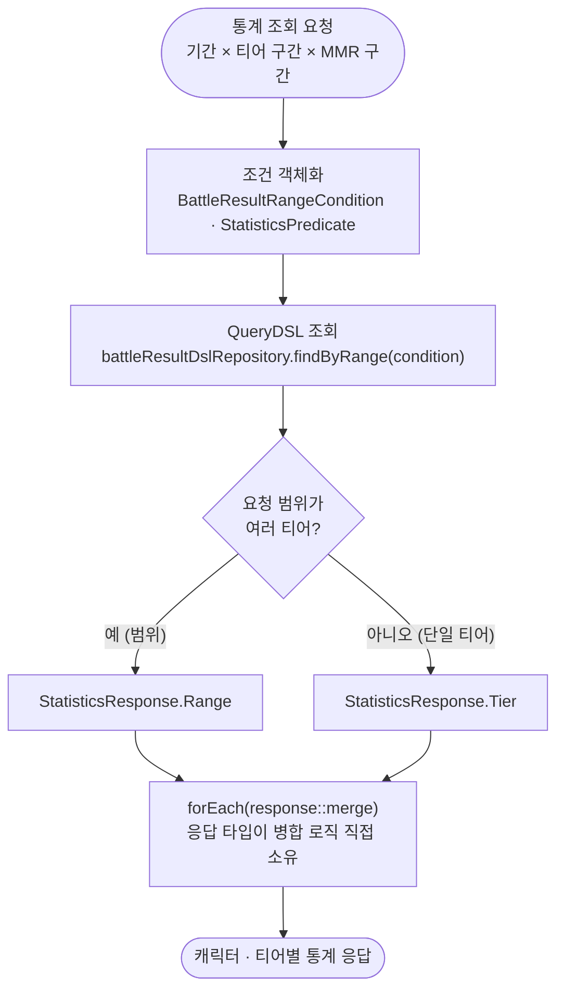
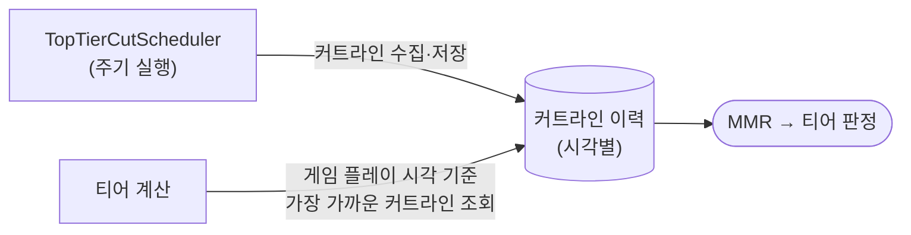

# 2. 통계 집계 설계

[← README로 돌아가기](../README.md)

기간·티어·MMR 조합 조건을 QueryDSL 조건 객체로 분리하고, 병합 로직은 응답 타입이 직접 소유하게 설계했습니다.

## 집계 흐름



## 조회 후 인메모리 병합

통계 조회 조건은 **기간 × 티어 구간 × MMR 구간**의 조합으로 들어옵니다. 조건에 맞는 `BattleResult`를 QueryDSL로 조회한 뒤, 응답 객체에 병합해 캐릭터·티어별 통계를 만듭니다.

```java
// StatisticsAggregationService — QueryDSL로 조건 조회 후 인메모리 병합
battleResultDslRepository.findByRange(condition)
        .forEach(response::merge);
```

## 설계상 신경 쓴 지점

- **응답 타입 분기** — 요청 범위가 여러 티어에 걸치면 `StatisticsResponse.Range`, 단일 티어면 `StatisticsResponse.Tier`로 병합 대상을 나눕니다. 병합 로직은 각 타입이 `merge()`로 직접 소유해, 집계 서비스는 조회와 분기만 담당합니다.
- **시즌 전체 집계** — `EnumMap<TierEnum, …>`에 티어별로 모은 뒤, 랭크 티어만 `SeasonTotal`로 다시 합칩니다. 티어 순서가 곧 `TierEnum` 선언 순서라 정렬 비용이 없습니다.
- **조회 조건 객체화** — `BattleResultRangeCondition`과 `StatisticsPredicate`로 QueryDSL 조건을 분리해, 서비스 코드에 쿼리 조건이 흩어지지 않게 했습니다.

## 티어 커트라인

티어 커트라인은 성격이 달라 별도로 처리합니다. `TopTierCutScheduler`가 주기적으로 커트라인을 수집·저장하고, 티어 계산 시에는 **게임 플레이 시각 기준**으로 가장 가까운 커트라인을 찾습니다. 같은 MMR이라도 시점에 따라 티어가 달라지기 때문입니다.


